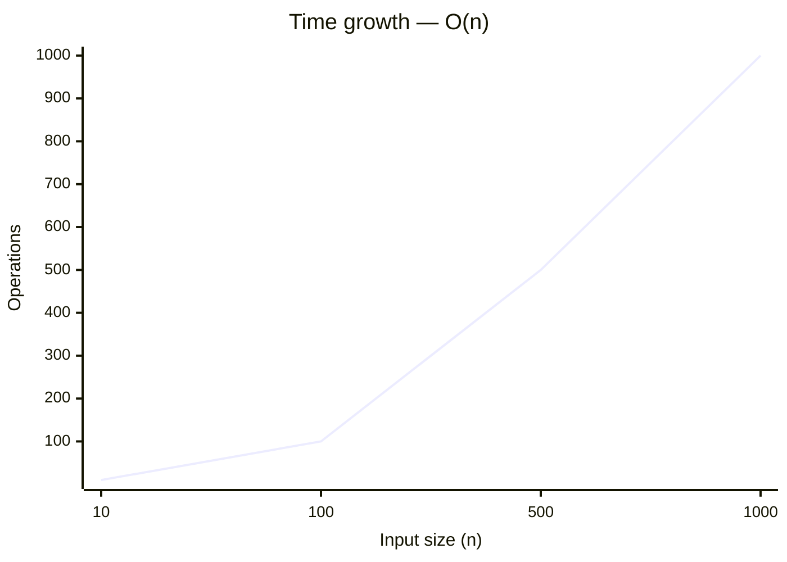
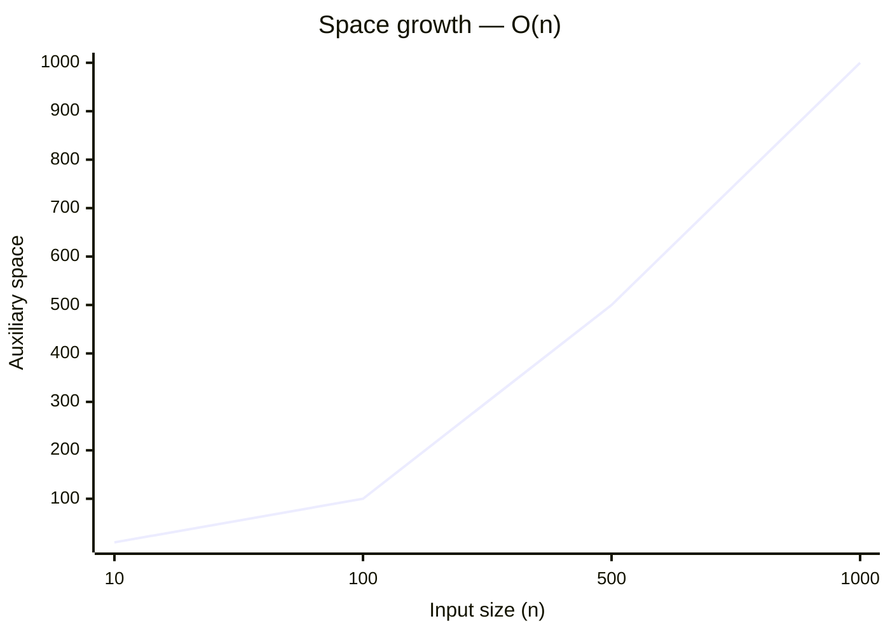

# 4. Median of Two Sorted Arrays

[Problem on LeetCode](https://leetcode.com/problems/median-of-two-sorted-arrays/)

## Performance

| Metric  | Value   | Beats |
|---------|---------|-------|
| Runtime | 25 ms | `█░░░░░░░░░` **5.9%** |
| Memory  | 95.1 MB | `████████░░` **80.1%** |

## Complexity

| | Complexity | Why |
|---|---|---|
| ⏱️ Time  | **O(n)** | a single pass over the input |
| 💾 Space | **O(n)** | stores input-dependent data in an auxiliary structure |

> ⚠️ _Complexity is **estimated** by static analysis of the code (loop nesting, sorting, recursion) — verify before relying on it._

📈 How this scales

**⏱️ Time — `O(n)`**

| n | 10 | 100 | 500 | 1000 |
|---|---|---|---|---|
| **operations** | 10 | 100 | 500 | 1,000 |

**💾 Space — `O(n)`**

| n | 10 | 100 | 500 | 1000 |
|---|---|---|---|---|
| **space units** | 10 | 100 | 500 | 1,000 |

## Constraints

- `nums1.length == m`
- `nums2.length == n`
- `0 <= m <= 1000`
- `0 <= n <= 1000`
- `1 <= m + n <= 2000`
- `-10^6 <= nums1[i], nums2[i] <= 10^6`

## Approach

_pending_

💡 Top community solutions

See how others approached this problem:

[Browse the highest-voted solutions on LeetCode ↗](https://leetcode.com/problems/median-of-two-sorted-arrays/solutions/?orderBy=most_votes)

---
*Synced by [LeetVault](https://github.com/PARTHDEVX2904/LEETCODE-DSA) · 2026-07-28*
