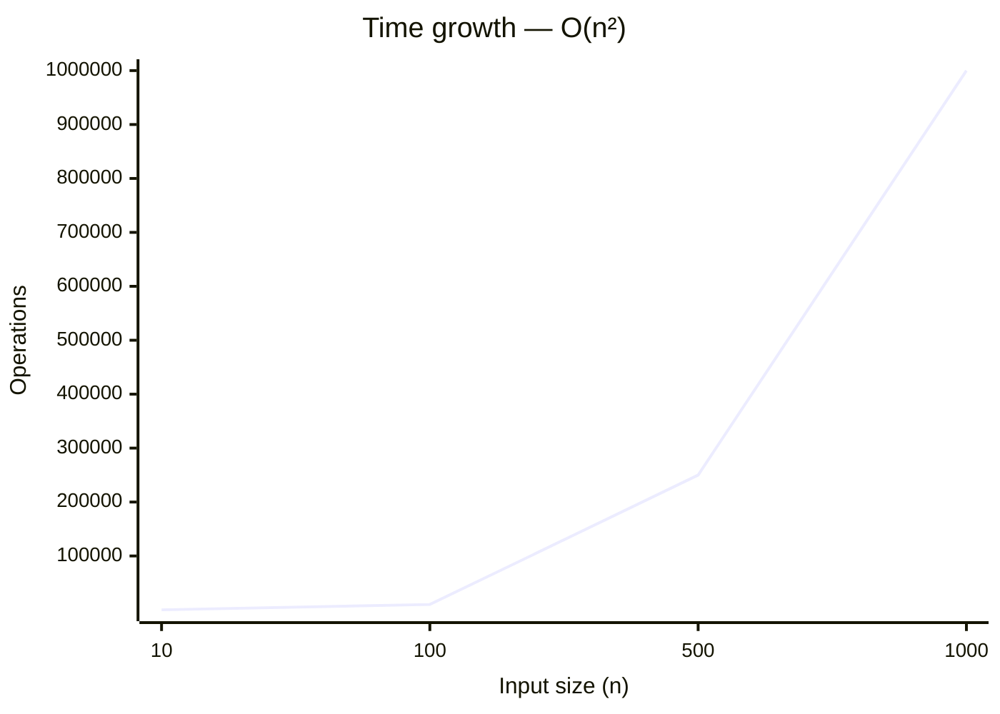

# 114. Flatten Binary Tree to Linked List


[Problem on LeetCode](https://leetcode.com/problems/flatten-binary-tree-to-linked-list/)

## Performance

| Metric  | Value   | Beats |
|---------|---------|-------|
| Runtime | 0 ms | `██████████` **100.0%** |
| Memory  | 17.7 MB | `██░░░░░░░░` **24.3%** |

## Complexity

| | Complexity | Why |
|---|---|---|
| ⏱️ Time  | **O(n²)** | two nested loops over the input |
| 💾 Space | **O(1)** | only a constant number of variables |

> ⚠️ _Complexity is **estimated** by static analysis of the code (loop nesting, sorting, recursion) — verify before relying on it._

<details open>
<summary>📈 How this scales</summary>

**⏱️ Time — `O(n²)`**



| n | 10 | 100 | 500 | 1000 |
|---|---|---|---|---|
| **operations** | 100 | 10,000 | 250,000 | 1,000,000 |

**💾 Space — `O(1)`**

```mermaid
xychart-beta
    title "Space growth — O(1)"
    x-axis "Input size (n)" [10, 100, 500, 1000]
    y-axis "Auxiliary space"
    line [1, 1, 1, 1]
```

| n | 10 | 100 | 500 | 1000 |
|---|---|---|---|---|
| **space units** | 1 | 1 | 1 | 1 |

</details>

## Constraints

- `The number of nodes in the tree is in the range [0, 2000].`
- `-100 <= Node.val <= 100`

## Approach

_pending_

<details>
<summary>💡 Top community solutions</summary>

See how others approached this problem:

[Browse the highest-voted solutions on LeetCode ↗](https://leetcode.com/problems/flatten-binary-tree-to-linked-list/solutions/?orderBy=most_votes)

</details>

---
*Synced by [LeetVault](https://github.com/PARTHDEVX2904/LEETCODE-DSA) · 2026-07-20*
