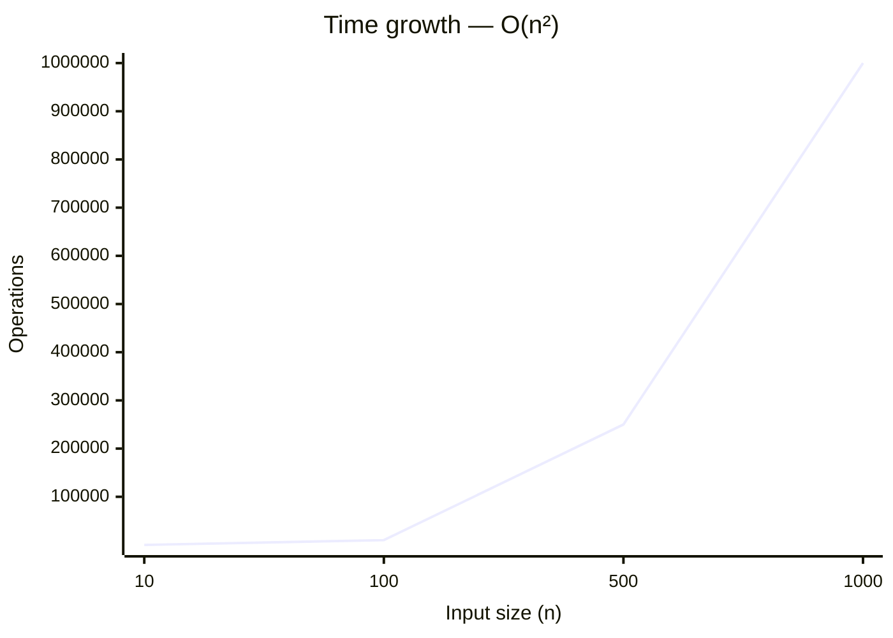
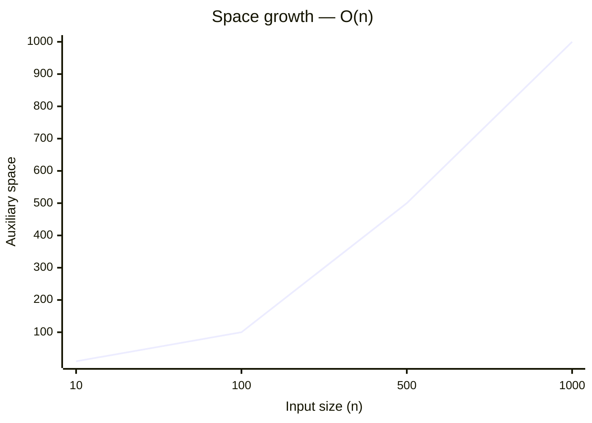

# 1260. Shift 2D Grid

[Problem on LeetCode](https://leetcode.com/problems/shift-2d-grid/)

## Performance

| Metric  | Value   | Beats |
|---------|---------|-------|
| Runtime | 0 ms | `██████████` **100.0%** |
| Memory  | 18.2 MB | `███████░░░` **66.3%** |

## Complexity

| | Complexity | Why |
|---|---|---|
| ⏱️ Time  | **O(n²)** | two nested loops over the input |
| 💾 Space | **O(n)** | stores input-dependent data in an auxiliary structure |

> ⚠️ _Complexity is **estimated** by static analysis of the code (loop nesting, sorting, recursion) — verify before relying on it._

📈 How this scales

**⏱️ Time — `O(n²)`**

| n | 10 | 100 | 500 | 1000 |
|---|---|---|---|---|
| **operations** | 100 | 10,000 | 250,000 | 1,000,000 |

**💾 Space — `O(n)`**

| n | 10 | 100 | 500 | 1000 |
|---|---|---|---|---|
| **space units** | 10 | 100 | 500 | 1,000 |

## Constraints

- `m == grid.length`
- `n == grid[i].length`
- `1 <= m <= 50`
- `1 <= n <= 50`
- `-1000 <= grid[i][j] <= 1000`
- `0 <= k <= 100`

## Approach

_pending_

💡 Top community solutions

See how others approached this problem:

[Browse the highest-voted solutions on LeetCode ↗](https://leetcode.com/problems/shift-2d-grid/solutions/?orderBy=most_votes)

---
*Synced by [LeetVault](https://github.com/PARTHDEVX2904/LEETCODE-DSA) · 2026-07-20*
