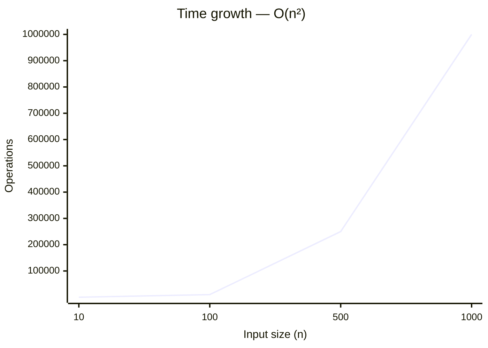
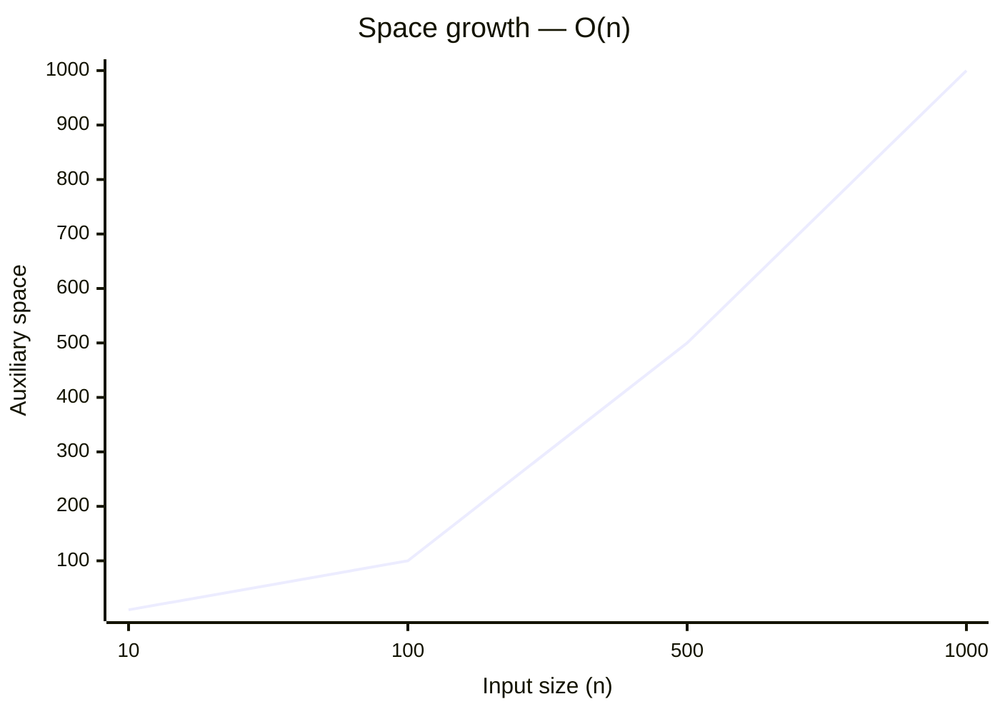

# 1462. Course Schedule IV

[Problem on LeetCode](https://leetcode.com/problems/course-schedule-iv/)

## Performance

| Metric  | Value   | Beats |
|---------|---------|-------|
| Runtime | 37 ms | `█████░░░░░` **47.9%** |
| Memory  | 31.9 MB | `██░░░░░░░░` **23.7%** |

## Complexity

| | Complexity | Why |
|---|---|---|
| ⏱️ Time  | **O(n²)** | two nested loops over the input |
| 💾 Space | **O(n)** | stores input-dependent data in an auxiliary structure |

> ⚠️ _Complexity is **estimated** by static analysis of the code (loop nesting, sorting, recursion) — verify before relying on it._

📈 How this scales

**⏱️ Time — `O(n²)`**

| n | 10 | 100 | 500 | 1000 |
|---|---|---|---|---|
| **operations** | 100 | 10,000 | 250,000 | 1,000,000 |

**💾 Space — `O(n)`**

| n | 10 | 100 | 500 | 1000 |
|---|---|---|---|---|
| **space units** | 10 | 100 | 500 | 1,000 |

## Constraints

- `2 <= numCourses <= 100`
- `0 <= prerequisites.length <= (numCourses * (numCourses - 1) / 2)`
- `prerequisites[i].length == 2`
- `0 <= a_i, b_i <= numCourses - 1`
- `a_i != b_i`
- `All the pairs [a_i, b_i] are unique.`
- `The prerequisites graph has no cycles.`
- `1 <= queries.length <= 10^4`
- `0 <= u_i, v_i <= numCourses - 1`
- `u_i != v_i`

## Approach

_pending_

💡 Top community solutions

See how others approached this problem:

[Browse the highest-voted solutions on LeetCode ↗](https://leetcode.com/problems/course-schedule-iv/solutions/?orderBy=most_votes)

---
*Synced by [LeetVault](https://github.com/PARTHDEVX2904/LEETCODE-DSA) · 2026-08-10*
