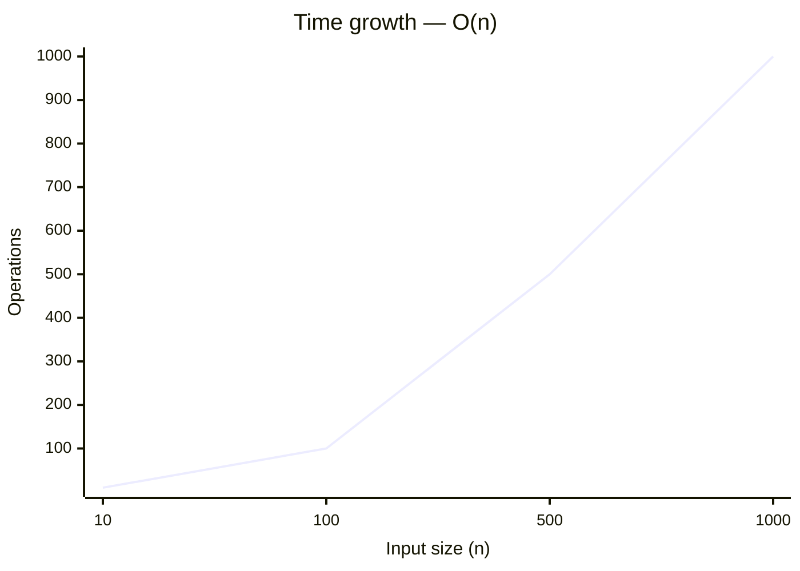

# 2657. Find the Prefix Common Array of Two Arrays


[Problem on LeetCode](https://leetcode.com/problems/find-the-prefix-common-array-of-two-arrays/)

## Performance

| Metric  | Value   | Beats |
|---------|---------|-------|
| Runtime | 3 ms | `█████████░` **90.7%** |
| Memory  | 19.4 MB | `███░░░░░░░` **30.3%** |

## Complexity

| | Complexity | Why |
|---|---|---|
| ⏱️ Time  | **O(n)** | a single pass over the input |
| 💾 Space | **O(1)** | only a constant number of variables |

> ⚠️ _Complexity is **estimated** by static analysis of the code (loop nesting, sorting, recursion) — verify before relying on it._

<details open>
<summary>📈 How this scales</summary>

**⏱️ Time — `O(n)`**



| n | 10 | 100 | 500 | 1000 |
|---|---|---|---|---|
| **operations** | 10 | 100 | 500 | 1,000 |

**💾 Space — `O(1)`**

```mermaid
xychart-beta
    title "Space growth — O(1)"
    x-axis "Input size (n)" [10, 100, 500, 1000]
    y-axis "Auxiliary space"
    line [1, 1, 1, 1]
```

| n | 10 | 100 | 500 | 1000 |
|---|---|---|---|---|
| **space units** | 1 | 1 | 1 | 1 |

</details>

## Constraints

- `1 <= A.length == B.length == n <= 50`
- `1 <= A[i], B[i] <= n`
- `It is guaranteed that A and B are both a permutation of n integers.`

## Approach

_pending_

<details>
<summary>💡 Top community solutions</summary>

See how others approached this problem:

[Browse the highest-voted solutions on LeetCode ↗](https://leetcode.com/problems/find-the-prefix-common-array-of-two-arrays/solutions/?orderBy=most_votes)

</details>

---
*Synced by [LeetVault](https://github.com/PARTHDEVX2904/LEETCODE-DSA) · 2026-08-27*
