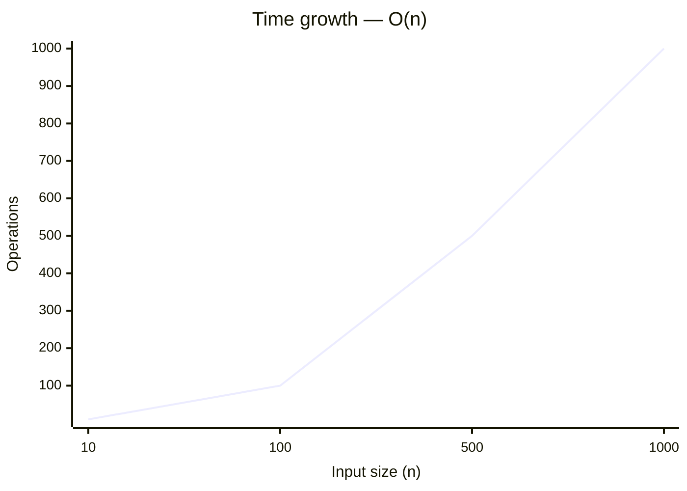
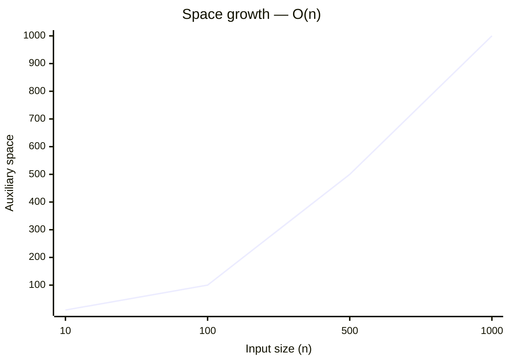

# 2870. Minimum Number of Operations to Make Array Empty

[Problem on LeetCode](https://leetcode.com/problems/minimum-number-of-operations-to-make-array-empty/)

## Performance

| Metric  | Value   | Beats |
|---------|---------|-------|
| Runtime | 130 ms | `█░░░░░░░░░` **5.6%** |
| Memory  | 95.7 MB | `████████░░` **78.7%** |

## Complexity

| | Complexity | Why |
|---|---|---|
| ⏱️ Time  | **O(n)** | a single pass over the input |
| 💾 Space | **O(n)** | stores input-dependent data in an auxiliary structure |

> ⚠️ _Complexity is **estimated** by static analysis of the code (loop nesting, sorting, recursion) — verify before relying on it._

📈 How this scales

**⏱️ Time — `O(n)`**

| n | 10 | 100 | 500 | 1000 |
|---|---|---|---|---|
| **operations** | 10 | 100 | 500 | 1,000 |

**💾 Space — `O(n)`**

| n | 10 | 100 | 500 | 1000 |
|---|---|---|---|---|
| **space units** | 10 | 100 | 500 | 1,000 |

## Constraints

- `2 <= nums.length <= 10^5`
- `1 <= nums[i] <= 10^6`

## Approach

_pending_

💡 Top community solutions

See how others approached this problem:

[Browse the highest-voted solutions on LeetCode ↗](https://leetcode.com/problems/minimum-number-of-operations-to-make-array-empty/solutions/?orderBy=most_votes)

---
*Synced by [LeetVault](https://github.com/PARTHDEVX2904/LEETCODE-DSA) · 2026-08-14*
