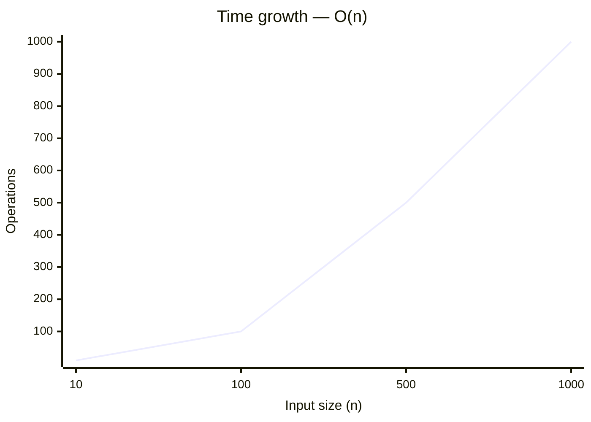
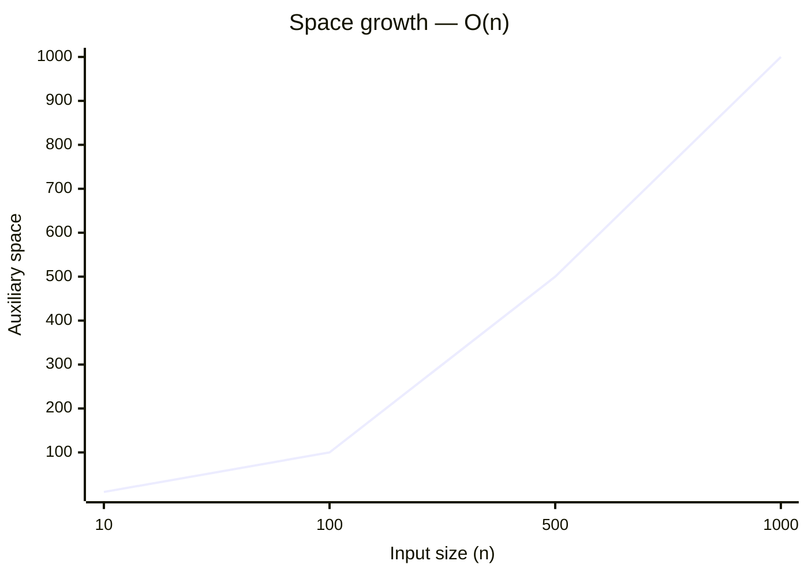

# 3414. Maximum Score of Non-overlapping Intervals

[Problem on LeetCode](https://leetcode.com/problems/maximum-score-of-non-overlapping-intervals/)

## Performance

| Metric  | Value   | Beats |
|---------|---------|-------|
| Runtime | 2321 ms | `██░░░░░░░░` **17.4%** |
| Memory  | 323.8 MB | `████░░░░░░` **41.3%** |

## Complexity

| | Complexity | Why |
|---|---|---|
| ⏱️ Time  | **O(n)** | a single pass over the input |
| 💾 Space | **O(n)** | stores input-dependent data in an auxiliary structure |

> ⚠️ _Complexity is **estimated** by static analysis of the code (loop nesting, sorting, recursion) — verify before relying on it._

📈 How this scales

**⏱️ Time — `O(n)`**

| n | 10 | 100 | 500 | 1000 |
|---|---|---|---|---|
| **operations** | 10 | 100 | 500 | 1,000 |

**💾 Space — `O(n)`**

| n | 10 | 100 | 500 | 1000 |
|---|---|---|---|---|
| **space units** | 10 | 100 | 500 | 1,000 |

## Constraints

- `1 <= intevals.length <= 5 * 10^4`
- `intervals[i].length == 3`
- `intervals[i] = [l_i, r_i, weight_i]`
- `1 <= l_i <= r_i <= 10^9`
- `1 <= weight_i <= 10^9`

## Approach

_pending_

💡 Top community solutions

See how others approached this problem:

[Browse the highest-voted solutions on LeetCode ↗](https://leetcode.com/problems/maximum-score-of-non-overlapping-intervals/solutions/?orderBy=most_votes)

---
*Synced by [LeetVault](https://github.com/PARTHDEVX2904/LEETCODE-DSA) · 2026-09-12*
