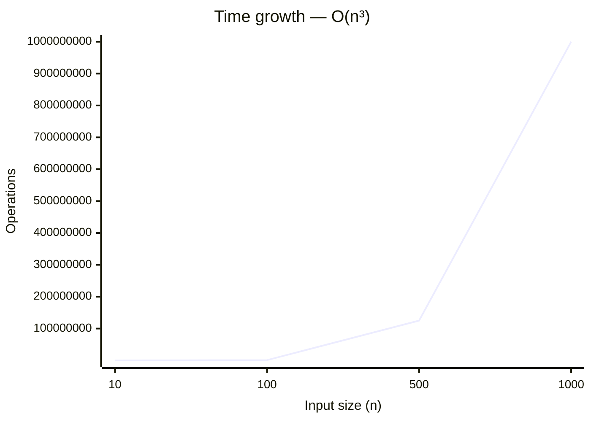
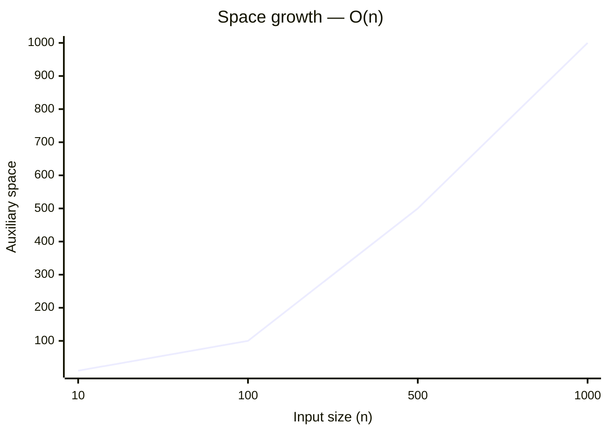

# 3483. Unique 3-Digit Even Numbers

[Problem on LeetCode](https://leetcode.com/problems/unique-3-digit-even-numbers/)

## Performance

| Metric  | Value   | Beats |
|---------|---------|-------|
| Runtime | 0 ms | `██████████` **100.0%** |
| Memory  | 29.7 MB | `████████░░` **79.6%** |

## Complexity

| | Complexity | Why |
|---|---|---|
| ⏱️ Time  | **O(n³)** | three nested loops over the input |
| 💾 Space | **O(n)** | stores input-dependent data in an auxiliary structure |

> ⚠️ _Complexity is **estimated** by static analysis of the code (loop nesting, sorting, recursion) — verify before relying on it._

📈 How this scales

**⏱️ Time — `O(n³)`**

| n | 10 | 100 | 500 | 1000 |
|---|---|---|---|---|
| **operations** | 1,000 | 1,000,000 | 125,000,000 | 1,000,000,000 |

**💾 Space — `O(n)`**

| n | 10 | 100 | 500 | 1000 |
|---|---|---|---|---|
| **space units** | 10 | 100 | 500 | 1,000 |

## Constraints

- `3 <= digits.length <= 10`
- `0 <= digits[i] <= 9`

## Approach

_pending_

💡 Top community solutions

See how others approached this problem:

[Browse the highest-voted solutions on LeetCode ↗](https://leetcode.com/problems/unique-3-digit-even-numbers/solutions/?orderBy=most_votes)

---
*Synced by [LeetVault](https://github.com/PARTHDEVX2904/LEETCODE-DSA) · 2026-09-11*
